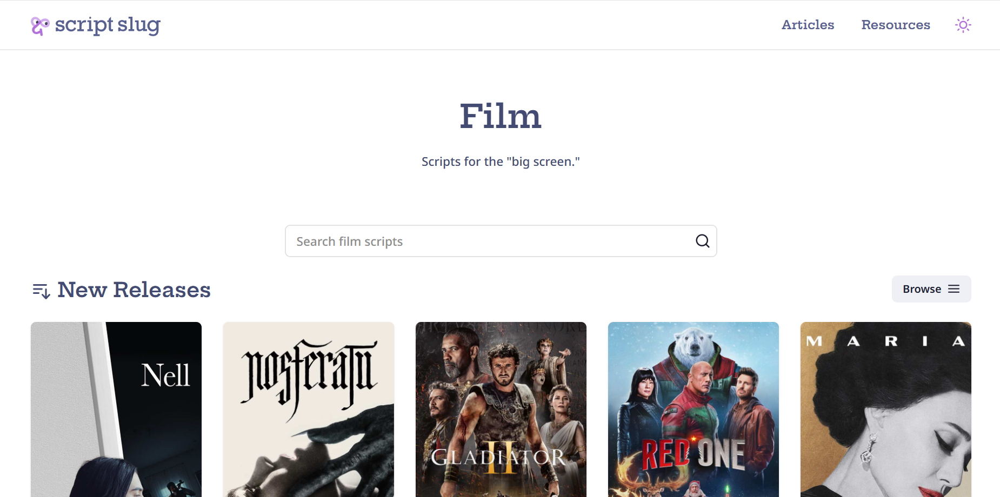
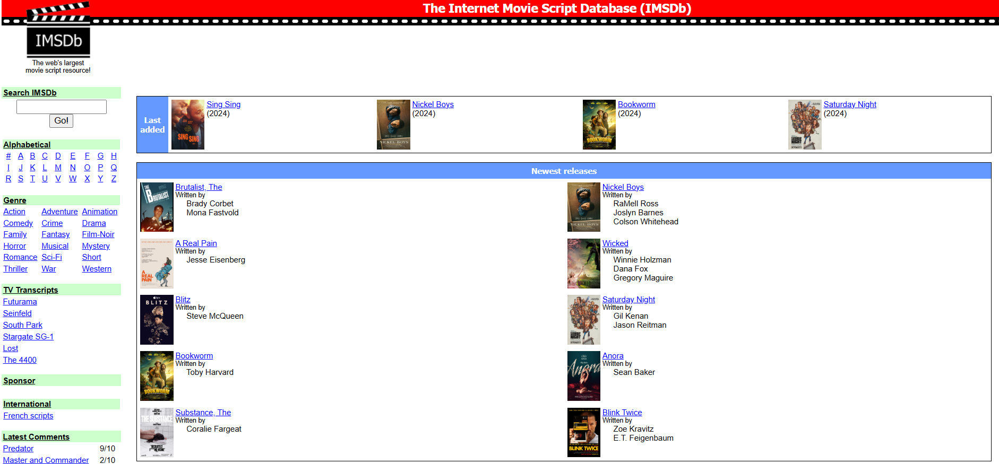
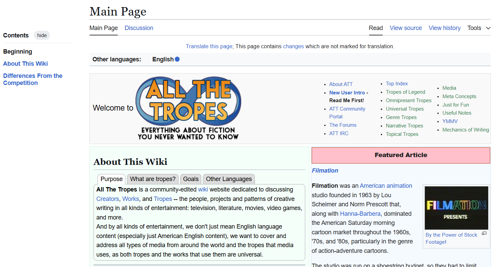
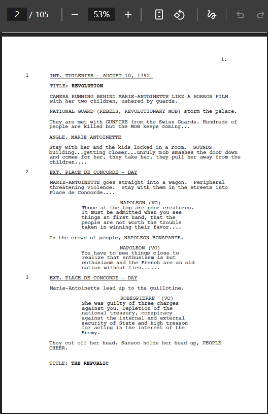
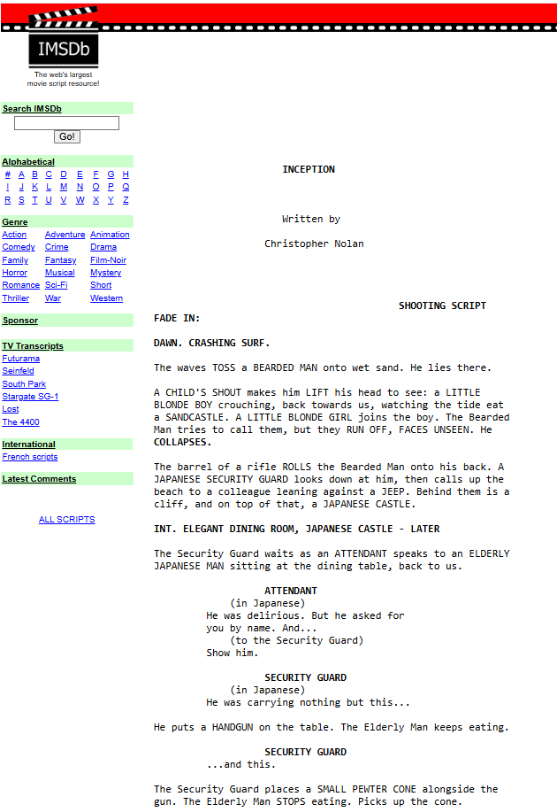
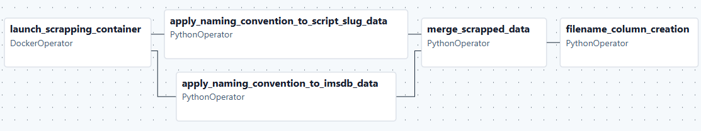
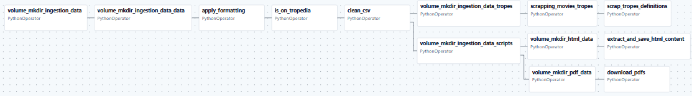

# DataEng 2024 Template Repository

 

Project [DATA Engineering](https://www.riccardotommasini.com/courses/dataeng-insa-ot/) is provided by [INSA Lyon](https://www.insa-lyon.fr/).

Students: JOUENNE Maia, TRON Baptiste, VIVIER Thibault

### Abstract

## Objectives 

The main idea behind this project is to learn how to implement a data pipeline from the sources of data to the production and analysis. It is also mandatory to use Airflow, a tool presented in class to realize this pipeline. Any other technology is welcome if their use could be justified in the context of the project. We will have to present the used technology, their pros and cons, and the specificities of each tool regarding the data, the state of the project and the other existing tools.

The purpose of the project is also to show our ability to deploy technical tools and answer to a professional use case of data engineering.

This project is an opportunity as a student to develop our skills in different fields like the development & coding, the architecture & conception of complex data flow, the implementation & deployment of this data flow, and the research and use of new tools depending on our needs.

This project is done only with educational purpose.

## Datasets Description 
### Data source introduction
 

**Script slug :** https://www.scriptslug.com/scripts/medium/film?sort=az
 

Script Slug is a popular online resource for screenwriters, especially those interested in animation and film. The site offers a growing library of original screenplays from major studios like Netflix, HBO, and Marvel, allowing users to study professional scripts for structure, pacing, and dialogue. It’s widely used by aspiring writers to improve their own screenwriting skills by reading and analyzing industry-standard scripts. Script Slug also provides educational tips and resources for animation screenwriting. The scripts are downloadable in pdf.

 

   

**ImsDB :** https://imsdb.com/alphabetical/0
 

IMSDb (Internet Movie Script Database) is a well-known online repository offering a vast collection of movie and TV show scripts. It provides free access to original screenplays, making it a valuable resource for screenwriters, film students, and cinephiles who want to study professional writing techniques. The site relies partly on community contributions to expand its library and keep scripts up to date. IMSDb is widely used for learning script structure, dialogue, and storytelling from real industry examples. There, the scripts are available on html pages.

 

   

**All the tropes (Wiki) :** https://allthetropes.org/wiki
 

AllTheTropes is a community-driven wiki dedicated to cataloging and explaining storytelling tropes—recurring themes, devices, and conventions—found in movies, TV shows, books, video games, and other media. Unlike other trope databases, AllTheTropes is open and collaborative, allowing anyone to contribute or edit entries. It serves as a valuable resource for writers, critics, and fans seeking to understand, analyze, or avoid clichés in storytelling. The site is especially useful for exploring how tropes evolve and are used across different genres and cultures.

 

   

**Some vocabulary :** 
 

The Cambridge online dictionary define a "Trope" as follow :
Trope, noun : something such as an idea, phrase, or image that is often used in a particular artist's work, in a particular type of art, in a media, etc.	Comparer : cliché.
 

Our definition : a trope is a recurring narrative conventions or schema used in storytelling. They are tools used by a writter. Tropes can be applied to almost everything : plot, characters, devices, themes, etc. 
 

Example : 
 
&nbsp;&nbsp;&nbsp;&nbsp;&nbsp;&nbsp;- Human-like robots is a classic Science Fiction tropes. You can find it in : Ex-Machina or Blade Runner.
 
&nbsp;&nbsp;&nbsp;&nbsp;&nbsp;&nbsp;- The vilan protagonist : a plot which implies that the protagonist followed is or become a vilain among the story. You can find it in : Breaking Bad or Night Call (NightCrawler)

 

   

### Purpose

Let's say it, we want to try to build an AI agent able to help a young writter to write his first script. The idea is NOT to automatize the script creation but to provide ideas, example and draft to the user to help him during his writting session.
 
It's beautiful, but... it is very ambitious. That's why our first objective is to try to buildt an AI model able to identify properly the tropes used in a movie script.

### Data description

#### Scripts
**PDF**
 
On the Scriptslug website, the movie scripts are available on PDF format. Those PDF files are often scanned pages or brut text. To extract the text content of those files, we will use an OCR (Optical Character Recognition) tool. 

 

   

**HTML**
 
On the ImsDB website, the movie scripts are available on HTML pages. It is possible to get the content of those pages, but it requires some cleaning to get the text content, with dedicated tools.

 

   

#### Tropes data

To fill, by B.

 
 
 
 

## Main tools introduction

### Docker
general presentation : refer to the lectures.
precise the use in this context.

### Airflow
general presentation : refer to the lectures.
precise the use in this context.

### MongoDB
general presentation : refer to the lectures.
precise the use in this context.

## Architecture 

### Global architecture
Describe the general architecture : explain what are the different DAGs, how they interact between each other (shared volume : project_data).
Explain the design choices : why using a scrapping DAG ? How the project_data volume is structured ? How the dockerc compose is built (which services ? why ?)? What is the project architecture (folder path) ? etc...?

Folder architecture : 
Here is the simplified folder architecture of the project.

M1_DATA_ENGINEERING
  |_dags
      |_scrapping_dag.py
      |_ingestion_dag.py
      |_stagging_dag.py
      |_shared_operators.py
      |_etc.
  |_logs (useful to monitor DAGs execution)
  |_scrapping_container
      |_scrapping
          |_scrapping_data (folder used as example to build the first volume folder)
              |_data
              |_logs
              |_statistics
          |_main.py
          |_scrapping_imsdb.py
          |_scrapping_script_slug.py
      |_Dockerfile (mandatory to build the associated image in the docker-compose.yml)
      |_requirements.txt (mandatory to install python requirements in the container)
      
  |_stagging_container
      |_stagging
          |_stagging_main.py
          |_stagging_pdf_content_extraction_ocr.py
          |_html_content_cleaning_file.py # to modify
      |_Dockerfile (mandatory to build the associated image in the docker-compose.yml)
      |_requirements.txt (mandatory to install python requirements in the container)
  |_docker-compose.yml
  |_README.md

DAG architecture :  
We choose to build at least one DAG per part of the Data engineering classical schema (cf. schema - add the image to the report). Then, we have a DAG for the ingestion of the data, the stagging phase and then for the production & analysis phase. We decide to add other DAG to segment the code, to keep a clear organization of the pipeline and of the different processes used. Here are the list of all our DAGs : 
    - scrapping_dag.py : to scrap data about data sources. Necessary to execute it before the ingestion_dag.py.
    - ingestion_dag.py : to ingest the data from the different sources.
    - stagging_dag.py : to clean the data and extract content from the raw data when needed.
    - ...

We also choose to add to the DAG's folder an other python script : shared_operators.py. This script contains a list of functions (operators) used by different DAGs. 

Execution order : (DAGs)
Precise it.

Volume architecture :
|_ingestion_data
    |_data
        |_contains multiple CSV files used in next steps 
    |_scripts
        |_html_data (contains html files)
        |_pdf_data (contains pdf files)
    |_tropes
        |_contains json files with tropes data.
|_scrapping_data
    |_data
        |_contains multiple CSV files used in next steps 
    |_logs
        |_to monitor container's execution
    |_statistics
        |_statistics about the scripts and data sources (useless for now)
|_stagging_data
    |_logs
    |_scripts
    (|_tropes)  didn't exist yet
        => we have to create the code to clean trope data.
        

 
 
 

### DAG 1 : scrapping DAG

#### General presentation

 

  

Our first Airflow DAG is dedicated to scrap information about the data from sources to prepare the data ingestion. This DAG allow us to get list of links, names, and merge information of the different data sources to define the range of the data ingestion (to avoid to scrap useless data, something essential regarding the cost of execution - time). This scrapping DAG requires specific tools which are Selenium and Chrome Browser. 
  
Due to those particular requirements (and also because it's challenging), we decide to use a DockerOperator in Airflow to launch a Container dedicated to the scrapping. The data scrapped are then send to a Docker Volume : project_data, shared with the other DAGs (to be able to access to the data from the different DAGs).
  

#### Specific tools 
Selenium : This is an Open source tool used for web navigation automatization. It is mainly used for web scrapping, like in this project. This tool can be used in python.

ChromeBrowser : Need to be installed to use Selenium, because Selenium is not a web browser but it drives a web browser to navigate.

To use thoses specific tools, we decide to build an exclusive image with required dependencies, instead of installing everything on the computer. This is a better practice and working with docker images is the best way to replicate the project and avoid versioning & OS problems (cf. Docker presentation).
  

#### Difficulties
**Volume management :** to handle multi-container writting
The volume was mounted each time at the building of each container (scrapping & stagging), and the file were written or copied into it during the building phase (replacing existing files in the volume).
But the thing was, when you mount a volume, it erased the previous content in it.

Let's take an example :
When I mount the volume on the first service : 'scrapper', the the img is built and the dockerfile is executed.
Inside this dockerfile, I copy the 'scrapping_data' folder into the volume as 'scrapping_data'

Then when I mount the volume on the 2nd service known as 'test', the 'scrapping_data' folder is erased and 
the volume content is now depending of what I'm doing in the dockerfile of this 2nd service.

  
The solution was to mount the same emty volume on each services.
The files are copied in the running app in dedicated folders. (ex: /app/scrapping_data)
It is important to be able to access to those files/folder from the execution environement (ex : in he DockerOperator, to access to the python file to execute)
Then, instead of executing python script with a CMD line in the dockerfile, we execute when needed, with the Airflow DockerOperator.
The scripts are accountable of the copy and the write of mandatory / necessary files in the shared named volume (project_data).

  

**Permission :**
Another difficulty was to manage the permission to write in the docker volume from the dag. While using the Docker Operator in Airflow, it was not the same user in the DAG and in the launched container. This distinction was the source of this write issue. 

To solve it, we decide to add a function to set permission in the main.py script in the scrapping_container, using os.chown() of python.

 
 
 

### DAG 2 : ingestion DAG

#### General presentation

 

  

Present fastly what the DAG is doing, which specific tools are used and what are the specificity of this DAG ?

#### Specific tools 
is there any specific tools in this DAG ?

#### Detailled operations
Let's have a look on each steps...

#### Difficulties
What was the hardiest things ? Why ? How we surpass them ?

 
 
 

### DAG 3 : stagging DAG

#### General presentation

**logical schema img** => take a screenshot of the DAG in Airflow

Present fastly what the DAG is doing, which specific tools are used and what are the specificity of this DAG ?

#### Specific tools 
OCR : pytesseract.

Html cleaning dedicated tools ?

#### Detailled operations
Let's have a look on each steps...

#### Difficulties
What was the hardiest things ? Why ? How we surpass them ?

 
 
 
 

## Queries 

## Requirements

## Note for Students

* Clone the created repository offline;
* Add your name and surname into the Readme file and your teammates as collaborators
* Complete the field above after project is approved
* Make any changes to your repository according to the specific assignment;
* Ensure code reproducibility and instructions on how to replicate the results;
* Add an open-source license, e.g., Apache 2.0;
* README is automatically converted into pdf

