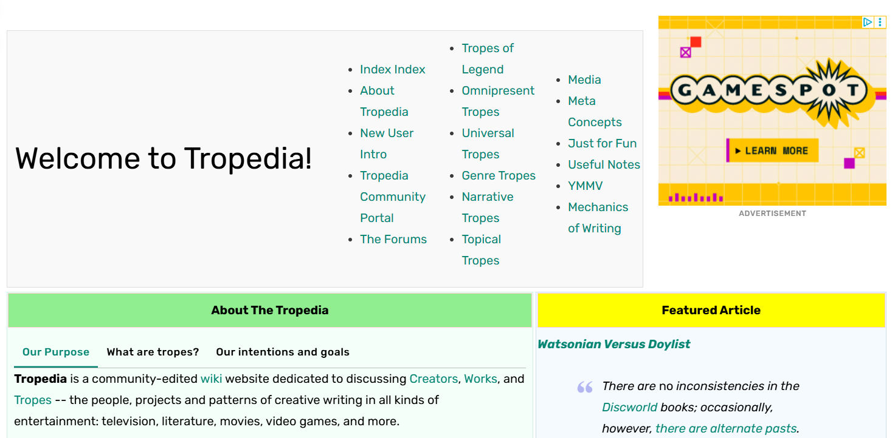
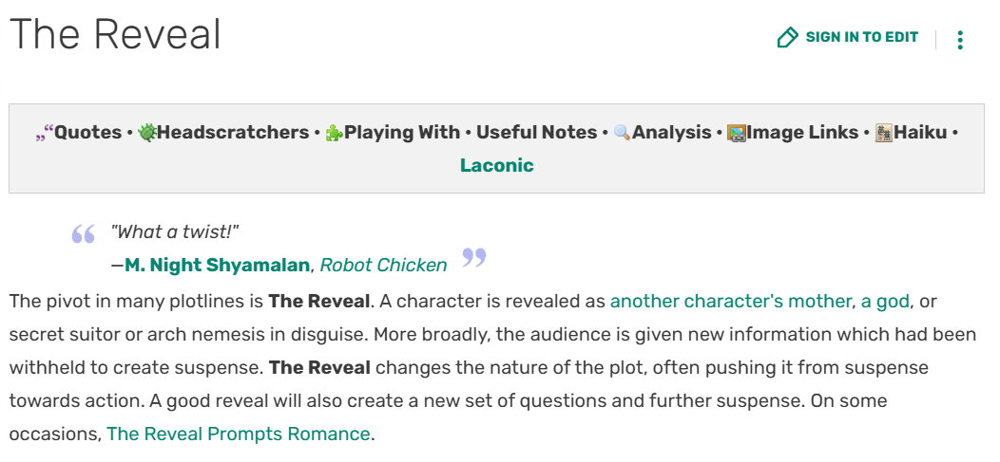
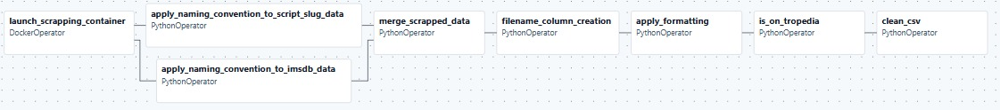
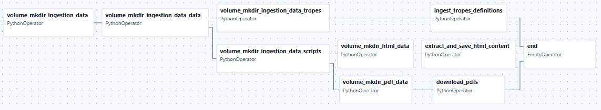
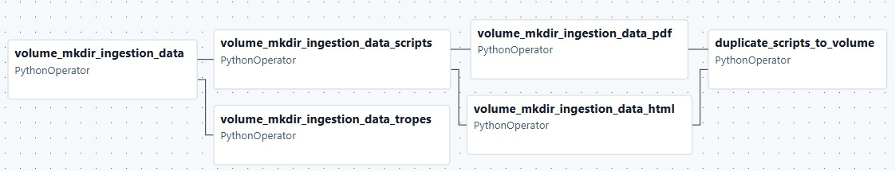
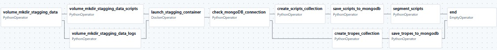
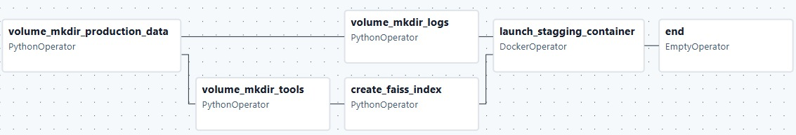

# DataEng 2024 Template Repository

 

Project [DATA Engineering](https://www.riccardotommasini.com/courses/dataeng-insa-ot/) is provided by [INSA Lyon](https://www.insa-lyon.fr/).

Students: JOUENNE Maia, TRON Baptiste, VIVIER Thibault

## Abstract

### Objectives 

The main idea behind this project is to create an AI model able to identify the tropes used in a movie script. We are also going to perform some statistics about the scripts ( eg. average number of scenes per script ).
 

**Some vocabulary :** 
 

The Cambridge online dictionary define a "Trope" as follow : *Trope* , noun : something such as an idea, phrase, or image that is often used in a particular artist's work, in a particular type of art, in a media, etc.	
  
Our definition : a trope is a recurring narrative conventions or schema used in storytelling. They are tools used by a writter. Tropes can be applied to almost everything : plot, characters, devices, themes, etc. 
 

Example : 
 
&nbsp;&nbsp;&nbsp;&nbsp;&nbsp;&nbsp;- Human-like robots is a classic Science Fiction tropes. You can find it in : Ex-Machina or Blade Runner.
 
&nbsp;&nbsp;&nbsp;&nbsp;&nbsp;&nbsp;- The vilan protagonist : a plot which implies that the protagonist followed is or become a vilain among the story. You can find it in : Breaking Bad or Night Call (NightCrawler)

 

   

## Datasets Description 

 

**Script slug :** https://www.scriptslug.com/scripts/medium/film?sort=az
 

Script Slug offers educational resources for screenwriters. The site offers free access to a huge database of movie and television series scripts in PDF format.

 

   

**ImsDB :** https://imsdb.com/alphabetical/0
 

IMSDb (Internet Movie Script Database) is a well-known online repository offering a vast collection of movie and TV show scripts. It provides free access to original screenplays, making it a valuable resource for screenwriters, film students, and cinephiles who want to study professional writing techniques. The site relies partly on community contributions to expand its library and keep scripts up to date. IMSDb is widely used for learning script structure, dialogue, and storytelling from real industry examples. There, the scripts are available on html pages.

 

   

**Tropedia (Wiki) :** https://tropedia.fandom.com/wiki/Tropedia

 

Tropedia is a community-edited wiki website dedicated to discussing Creators, Works, and Tropes -- the people, projects and patterns of creative writing in all kinds of entertainment: television, literature, movies, video games, and more.

 

   

## Data description

### Scripts
**PDF**
 
On the Scriptslug website, the movie scripts are available on PDF format. Those PDF files are often scanned pages or brut text. To extract the text content of those files, we will use an OCR (Optical Character Recognition) tool. 

 

 

**HTML**
 
On the ImsDB website, the movie scripts are available on HTML pages. It is possible to get the content of those pages, but it requires some cleaning to get the text content, with dedicated tools.
 

  

### Tropes data
 

On the Tropedia wiki, the definition of tropes is provided in several paragraphs. Since Tropedia does not consist only of tropes taken from movies, we have only included tropes from movies for which we have the scripts.

 
 
 

### DAG 1 : scrapping DAG

#### General presentation

 

 

Our first Airflow DAG is dedicated to scrap information about the data from sources to prepare the data ingestion. This DAG allow us to get list of links, names, and merge information of the different data sources to define the range of the data ingestion (to avoid to scrap useless data, something essential regarding the cost of execution - time). This scrapping DAG requires specific tools which are Selenium and Chrome Browser.
  
The DAG starts by using a DockerOperator to launch a Container dedicated to the scrapping. The data scrapped are then send to a Docker Volume : project_data, shared with the other DAGs (to be able to access to the data from the different DAGs), This container collect movie scripts information from ImsDB and ScriptSlug. We then clean the data and use a standard naming format to combine these sources into a single CSV file.
Next, the pipeline searches for these specific films on Tropedia in order to find the tropes associated with them, checking whether Tropedia contains a page with information about the film. This ensures we only collect tropes for the scripts we actually have. Finally, the system creates two clean CSV files: one containing the script details and the other containing the tropes, both ready to be used in the ingestion part.

 

#### Specific tools 

Selenium : This is an Open source tool used for web navigation automatization. It is mainly used for web scrapping, like in this project. This tool can be used in python.

ChromeBrowser : Need to be installed to use Selenium, because Selenium is not a web browser but it drives a web browser to navigate.

To use thoses specific tools, we decide to build an exclusive image with required dependencies, instead of installing everything on the computer. This is a better practice and working with docker images is the best way to replicate the project and avoid versioning & OS problems (cf. Docker presentation).

 

#### Difficulties
**Volume management :** to handle multi-container writting
The volume was mounted each time at the building of each container (scrapping & stagging), and the file were written or copied into it during the building phase (replacing existing files in the volume).
But the thing was, when you mount a volume, it erased the previous content in it.

Let's take an example :
When we mount the volume on the first service : 'scrapper', the img is built and the dockerfile is executed. Inside this dockerfile, we copy the 'scrapping_data' folder into the volume as 'scrapping_data'
Then when we mount the volume on the 2nd service known as 'test', the 'scrapping_data' folder is erased and the volume content is now depending of what I'm doing in the dockerfile of this 2nd service.

 

The solution was to mount the same empty volume on each services.
The files are copied in the running app in dedicated folders. (ex: /app/scrapping_data)
It is important to be able to access to those files/folder from the execution environement (ex : in he DockerOperator, to access to the python file to execute)
Then, instead of executing python script with a CMD line in the dockerfile, we execute when needed, with the Airflow DockerOperator.
The scripts are accountable of the copy and the write of mandatory / necessary files in the shared named volume (project_data).

 

**Permission :**
Another difficulty was to manage the permission to write in the docker volume from the dag. While using the Docker Operator in Airflow, it was not the same user in the DAG and in the launched container. This distinction was the source of this write issue. 
To solve it, we decide to add a function to set permission in the main.py script in the scrapping_container, using os.chown() of python.

 
 
 

### DAG 2 : ingestion DAG

#### General presentation

 

 

The dag begins by creating the directory hierarchy within the Docker volume. It establishes separate dedicated paths for tropes and scripts to ensure a clean workspace for further processing. Then the tropes are saved in a .json file with their definition. 
The DAG splits script ingestion into two parallel streams:

- HTML Stream: Fetches raw text content from web-based scripts and saves them as text files.
- PDF Stream: Downloads and stores script documents directly.

 
 
 

### DAG 3 : load local data DAG

#### General presentation

 

 

This third dag is dedicated to save some data in local, in order to ensure that we can run the pipeline offline (as expected).
  
The dag builds the required directory tree within the shared volume, creating organized storage paths for movie scripts (categorized by PDF and HTML formats) and narrative tropes. Once the infrastructure is ready, it duplicates the local raw data into these specific volume folders.
  

 
 
 

### DAG 4 : stagging DAG

#### General presentation

 

  
This DAG corresponds to the staging phase of the pipeline. The goal is to transform the raw ingested data (HTML scripts, PDF scripts, and tropes) into clean and usable data that we then store in MongoDB.

The DAG starts by creating the required directory structure inside the shared Docker volume project_data. These folders are used to store logs and processed scripts during the staging process.

Once the folders are ready, the DAG launches a dedicated staging container. This container executes the script stagging_main.py, which handles all the staging logic.

Inside the staging container, two main processing pipelines are executed:

1. **HTML scripts cleaning**
   
Scripts collected in HTML format during the ingestion phase are cleaned to remove unnecessary elements such as menus, navigation blocks, and repeated headers. The cleaned text is then saved as .txt files in the staging directory.

2. **PDF scripts OCR extraction**
   
Scripts collected as PDF files are processed using an OCR pipeline. Each PDF is converted into images, and then text is extracted page by page using OCR tools. The extracted text is saved as .txt files in the same staging directory.

After that task is completed, it inserts the staged data into 2 collections in MongoDB:

- **Scripts collection**: one document per movie, containing the full cleaned script text.

- **Tropes collection**: one document per trope, containing its name and definition.

Finally, the DAG executes a segmentation step. This step processes the cleaned scripts and splits them into smaller logical units (for example scenes or narrative blocks). This segmentation prepares the data for the production and analysis phases.

#### Specific tools

##### OCR (PDF to text)
The OCR pipeline is implemented using:

- **pdf2image** to convert PDF pages into images

- **pytesseract** to extract text from images

The extraction is done page by page to limit memory usage and reduce execution costs.

##### HTML cleaning
HTML scripts are cleaned using:

- **lxml.html**

- **Cleaner** from lxml_html_clean

These tools remove irrelevant HTML content and keep only the useful script text. A specific marker (ALL SCRIPTS) is used to remove unwanted sections that appear because of the scrapping.

##### Segmentation
The segmentation step processes all staged scripts and splits them into smaller textual units. This step is executed through a dedicated Python function and prepares the scripts for further analysis and production workflows (to be able to analyze each tropes per scene).

##### MongoDB
MongoDB is used as the main storage system for staged data. Two collections are created:

- movies: containing the full text of each movie script

- tropes: containing trope names and definitions
 
 
 

### DAG 5 : production DAG

#### General presentation

 

  

Our last Airflow DAG is dedicated to do the movie script analysis from MongoDB data. To perform this analysis, we decide to use an hybrid approach : analyze each scene of a script to find relevant trope using FAISS index and a LLM model to perform a verification. "Global analysis ?"
  
The DAG strats by creating the required folder Inside the Docker volume, "project_data". After the folders creation, we use a Python operator to create the FAISS index using the faiss and sentence_transformers packages. Finally, a Docker Operator is used to launch the analysis_container, where the analysis is performed.
  
To perform the analysis, we decide to use PySpark. The idea is to parallelize the analysis operations to save execution time and ressources. There are 3 main steps :
 - embed the scene content using the same model than the tropes embedding (Bert) - this is a model specialized in semantic analysis.
 - similarity calculation : retrieve the 3 most relevant tropes stored in the faiss indexes for each scene.
 - call a LLM with a specific prompt to improve the result and confirm or infirm the first analysis.

 

#### Specific tools

**FAISS**: This a Library developped by Meta to perform similarity research on large vectorial dataset.
  

**Hugging face** (transformers python package) : Allow us to easily manipulate pre-trained LLM in our code. With this tool, we can call a LLM model with a dedicated prompt to get a generated response. This is one of the simpliest way to use a LLM in a python code.
  

**PySpark** : PySpark is an Opensource tool used in Big Data. It allow us to manage huge ammount of data and parrallelize operation between multiple cores in local or in a cluster of machine. In our case, it is interresting to use to parrallelize the movie scene analysis. 
  

Again, using those specific tools required a dedicated container to isolate the heavy requirement from the Airflow environement.

 

#### Difficulties

**Large python requirements** : building issues. It was important to cache the requirements installation to avoid important execution time each time we decide to refactor our code or push some modifications.

 
 
 

## Queries 

## Requirements

 
 
 

## Architecture 

### Global architecture
Describe the general architecture : explain what are the different DAGs, how they interact between each other (shared volume : project_data).
Explain the design choices : why using a scrapping DAG ? How the project_data volume is structured ? How the dockerc compose is built (which services ? why ?)? What is the project architecture (folder path) ? etc...?

Folder architecture : 
Here is the simplified folder architecture of the project.

M1_DATA_ENGINEERING
  |_dags
      |_scrapping_dag.py
      |_ingestion_dag.py
      |_stagging_dag.py
      |_shared_operators.py
      |_etc.
  |_logs (useful to monitor DAGs execution)
  |_scrapping_container
      |_scrapping
          |_scrapping_data (folder used as example to build the first volume folder)
              |_data
              |_logs
              |_statistics
          |_main.py
          |_scrapping_imsdb.py
          |_scrapping_script_slug.py
      |_Dockerfile (mandatory to build the associated image in the docker-compose.yml)
      |_requirements.txt (mandatory to install python requirements in the container)
      
  |_stagging_container
      |_stagging
          |_stagging_main.py
          |_stagging_pdf_content_extraction_ocr.py
          |_html_content_cleaning_file.py # to modify
      |_Dockerfile (mandatory to build the associated image in the docker-compose.yml)
      |_requirements.txt (mandatory to install python requirements in the container)
  |_docker-compose.yml
  |_README.md

DAG architecture :  
We choose to build at least one DAG per part of the Data engineering classical schema (cf. schema - add the image to the report). Then, we have a DAG for the ingestion of the data, the stagging phase and then for the production & analysis phase. We decide to add other DAG to segment the code, to keep a clear organization of the pipeline and of the different processes used. Here are the list of all our DAGs : 
    - scrapping_dag.py : to scrap data about data sources. Necessary to execute it before the ingestion_dag.py.
    - ingestion_dag.py : to ingest the data from the different sources.
    - stagging_dag.py : to clean the data and extract content from the raw data when needed.
    - ...

We also choose to add to the DAG's folder an other python script : shared_operators.py. This script contains a list of functions (operators) used by different DAGs. 

Execution order : (DAGs)
Precise it.

Volume architecture :
|_ingestion_data
    |_data
        |_contains multiple CSV files used in next steps 
    |_scripts
        |_html_data (contains html files)
        |_pdf_data (contains pdf files)
    |_tropes
        |_contains json files with tropes data.
|_scrapping_data
    |_data
        |_contains multiple CSV files used in next steps 
    |_logs
        |_to monitor container's execution
    |_statistics
        |_statistics about the scripts and data sources (useless for now)
|_stagging_data
    |_logs
    |_scripts
    (|_tropes)  didn't exist yet
        => we have to create the code to clean trope data.
        

 
 
 

